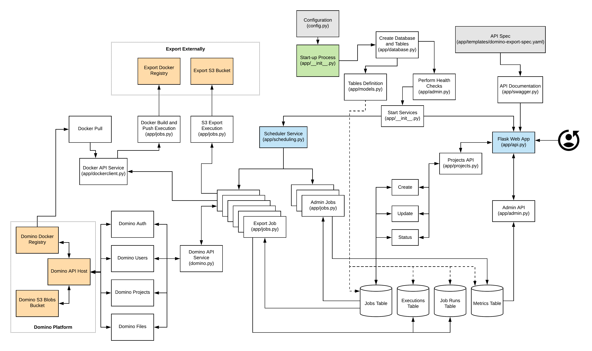

# Domino Export Service Project

The Domino Export Service Project is designed to help export Domino Project files to an external data storage system (like S3) and Domino Compute Environments to an external Docker Registry.

## Getting the Source Code

The Domino Export Service Project is hosted on GitHub:

https://github.com/dominodatalab/domino-export-service

Here you can get the source code, read through the issues and start contributing.

## Project Dependencies
These are all covered in requirements.txt for automatic instalation during the build phase.

> Python 3.8
>
> gunicorn - https://gunicorn.org/
>
> flask v1.1.2 - https://flask.palletsprojects.com/en/1.1.x/
>
> sqlalchemy v1.3.16 - https://www.sqlalchemy.org/
>
> apscheduler v3.6.3 - https://pypi.org/project/APScheduler/
>
> cryptography v2.9.2 - https://github.com/pyca/cryptography
>
> smart-open v2.0.0 - https://github.com/RaRe-Technologies/smart_open
>
> docker v4.2.0 - https://docker-py.readthedocs.io/en/stable/
>
> flask\_swagger\_ui v3.25.0 - https://github.com/sveint/flask-swagger-ui
>
> stopit v1.1.2 - https://pypi.org/project/stopit/

## Project Details

The overall design is detailed here:



The overall import files with descriptions are as follows:
> Dockerfile - Docker instructions to build the Docker image for the service
> 
> build.sh - build script
>
> init.sh - initialization script to create database and configuration files
>
> run.sh - run script to start the Docker service
>
> app - folder contents for the full application
> 
> instance - instance contents (database files, encrpytion keys, configuration, and log files) for a running instance of the application

Inside of the app folder (order of importance):
> __init__.py - starts the whole application and all services (Encryption, Scheduler, Database, and Web Application)
>
> default_config.py - defines default values for all application configuration items (values can be overridden by instance/config.py)
>
> api.py - Flask definitions for all of the APIs
>
> database.py - database control and connectivity abstraction layers
> 
> models.py - define the SQLAlchemy models (table structures)
> 
> scheduling.py - scheduler (APScheduler) control abstraction layers
> 
> encryption.py - encryption control abstraction layers
> 
> dockerclient.py - Docker client control abstraction layers
>
> jobs.py - defines all of the logic for any scheduled task/job
> 
> admin.py - Logic for all admin API calls
> 
> projects.py - Logic for all project API calls
> 
> status.py - defines all of the Job status codes
> 
> swagger.py - Flask definitions for Swagger API documentation
> 
> dbcommon.py - Logic for all database logic
> 
> helpers.py - Logic for common helper functions

Inside of the app/templates folder:
> domino-export-spec.yaml - the OpenAPI/Swagger spec for the API service


## Deep-dive into jobs.py

TODO

## Building the Source Code

Make sure you modify build.sh to define the IMAGE_NAME you want to use. This should be tied to a Docker image name that can be pushed to your personal Docker Registry.

Then run `build.sh`, which will build the Docker image and push it to your registry.

Otherwise, please manually build using the following steps:

```sh
IMAGE_NAME="domino-export-service:v1"
docker build $PWD $IMAGE_NAME
\# Optionally push or just run the image locally
docker push $IMAGE_NAME
```

## Running the Service

### First Run

On the first run, please execute the following command to create all of the application instance files
```sh
bash init.sh
```

This will create the following files in the `instance` folder:
> config.py - overrides for default configuration values
> 
> data/domino_exports.db - a SQLite database where all of the data for the application is stored
> 
> data/encrypt.key - an encryption key that is tied to the database (without this file, you cannot decrypt the database contents)
> 
> docker_templates/Standard.Dockerfile - the Docker instructions to apply to all exported images. Please do not modify the first line of this file, but you can add any additional Docker instructions after line 1.

### Configuration Deep-dive

TODO

### Starting the Service

You can start the service at any point by running the following command:
```sh
bash run.sh
```

This will push all logs to the `instance/logs` folder.

If you would rather run the service interactively (logs go to screen), run the following:
```sh
bash run.sh -i
```

## Restarting the Service

You should be able to restart the service with the following command:
```sh
docker restart domino-export
```

## License

Domino Export Service code is freely available to use without restrictions. However, no explicit or implicit warranty or gaurantees are provided by the authors or Domino Data Lab. We will attempt to fix bugs in a timely manner, but use at your own discretion and risk. Feel free to fork this project and make modifications to your needs.

